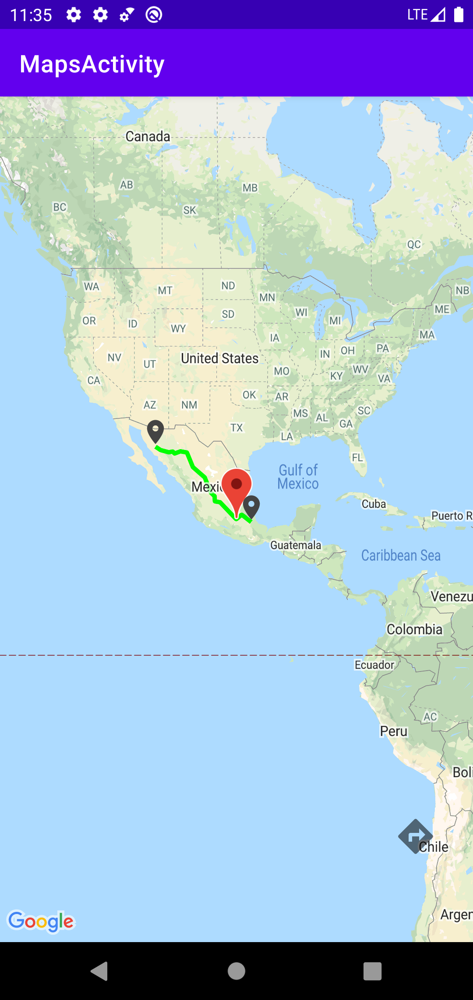
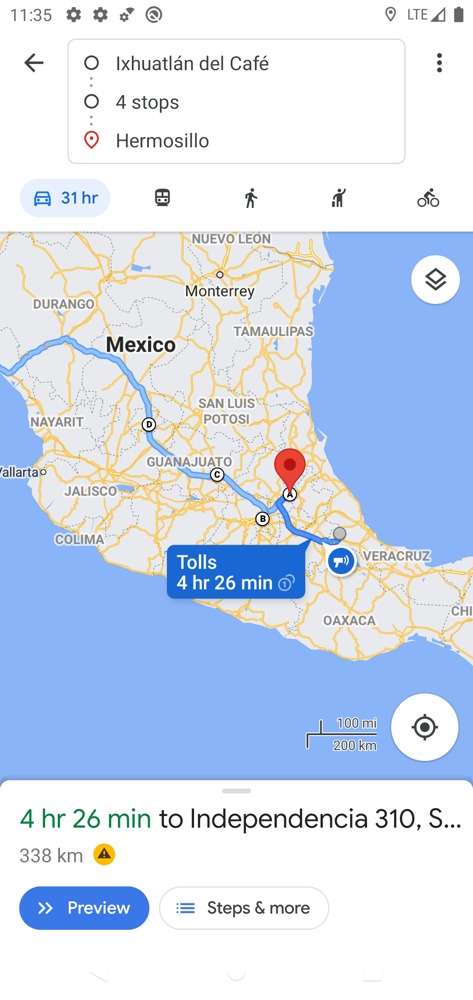

# EasyRoutes
[](https://jitpack.io/#AntonioHReyes/EasyRoutes)
[](https://android-arsenal.com/details/1/8275)

EasyRoutes allows you to easily draw routes through the google maps address api.

Note: You need to generate an API key from the google console with the directions API and add INTERNET permission in manifest.

## Setup
Gradle:
Add in your root build.gradle.

```gradle
allprojects {
    repositories {
        maven { url 'https://jitpack.io' }
    }
}
```

Add the dependency in your app build.gradle.

```gradle
dependencies {
	        implementation 'com.github.AntonioHReyes:EasyRoutes:$version'
	}
```

if you have the next error:

```
Caused by: org.gradle.api.InvalidUserCodeException: Build was configured to prefer settings repositories over project repositories but repository 'maven' was added by build file 'build.gradle'
```

modify your settings.gradle to:
```
dependencyResolutionManagement {
    repositoriesMode.set(RepositoriesMode.PREFER_SETTINGS)
    repositories {
        google()
        mavenCentral()
        jcenter() // Warning: this repository is going to shut down soon
        maven { url 'https://jitpack.io' }
    }
}
```

Otherwise you have to use library directly in your project.

## USAGE

first you need to define an instance of EasyRoutesDirections with which
you can pass properties to query the google directions API.

a full properties example:

```kotlin
val placeDirections = EasyRoutesDirections(
            originPlace = "Ixhuatlán del café, Veracruz, México",
            destinationPlace = "Hermosillo, Sonora, México",
            apiKey = getString(R.string.google_maps_key),
            waypointsLatLng = arrayListOf(
                LatLng(20.077550759401632, -98.36895687240255),
                LatLng(19.43488491844211, -99.13136781301444)
            ),
            waypointsPlaces = arrayListOf(
                "Santiago de Queretaro",
                "Aguascalientes"
            ),
            showDefaultMarkers= false,
            transportationMode = TransportationMode.WALKING
        )
```

you can mix LatLng and String places of origin and destination.

```kotlin
val placeAndLatLng = EasyRoutesDirections(
            originPlace = "Oaxaca",
            destinationLatLng = LatLng(19.417708496429597, -102.05174097597963),
            apiKey = getString(R.string.google_maps_key)
        )

val latLngAndPlace = EasyRoutesDirections(
    originLatLng = LatLng(19.417708496429597, -102.05174097597963),
    destinationPlace = "Merida, Yucatan, México",
    apiKey = getString(R.string.google_maps_key)
)
```

Note: you can't define a two origins or two destinations.

a description of properties:

| Parameter             | Type                  | Description                                                                        |
| :--------             | :-------              | :----------------------------------------------------------------------------------|
| `api_key`             | `String`              | **Required**. Your API key from google cloud                                       |
| `originLatLng`        | `LatLng`              | Your origin in latitude and longitude values                                        |
| `originPlace`         | `String`              | Your origin in String format for example Oaxaca                                    |
| `destinationLatLng`   | `LatLng`              | Your destination in latitude and longitude values                                   |
| `destinationPlace`    | `String`              | Your destination in String format for example Aguascalientes                       |
| `waypointsLatLng`     | `Array<LatLng>`       | Specifies an array of intermediate locations in latitude and longitude values        |
| `waypointsPlaces`     | `Array<String>`       | Specifies an array of intermediate locations in String format                      |
| `transportationMode`  | `TransportationMode`  | Specify the transportation mode to use by default is DRIVING                       |
| `showDefaultMarkers`  | `Boolean`             | Flag to show default markers in origin and destination                             |

next you need to define a EasyDrawer Builder to customize the route.

```kotlin
val routeDrawer = EasyRoutesDrawer.Builder(mMap)
            .pathWidth(10f)
            .pathColor(Color.GREEN)
            .geodesic(true)
            .previewMode(false)
            .build()
```

a description of properties:

| Parameter             | Type                  | Description                                                                                       |
| :--------             | :-------              | :-------------------------------------------------------------------------------------            |
| `pathWidth`           | `Float`               | Width of you path drawn by default is 12f                                                        |
| `pathColor`           | `Int`                 | Color of you path by default is Color.MAGENTA                                                     |
| `geodesic`            | `Boolean`             | Specifies whether to draw each segment of this polyline as a geodesic by default is true          |
| `previewMode      `   | `Boolean`             | Specify the property to paint the path if true selects overview Polyline defaults to true         |

Note: if you like view the route with precision use previewMode in false.

you can pass a custom polyline for better handling.
```kotlin
val customPolylineOptions = PolylineOptions()
customPolylineOptions.color(ContextCompat.getColor(this@MapsActivity, R.color.red))
customPolylineOptions.width(15f)

val routeDrawerWithCustomPolyline = EasyRoutesDrawer.Builder(mMap, customPolylineOptions)
            .previewMode(false)
            .build()
```

finally use a map extension function fo pain the route.
```kotlin
mMap.drawRoute(
    context = this@MapsActivity,
    easyRoutesDirections = placeDirections,
    routeDrawer = routeDrawer,
    markersListCallback = {markers -> markersList.addAll(markers) },
    googleMapsLink = { url -> Log.d("GoogleLink", url)}
){ legs ->
    legs?.forEach {
        Log.d("Point startAddress:", it?.startAddress.toString())
        Log.d("Point endAddress:", it?.endAddress.toString())
        Log.d("Distance:", it?.distance.toString())
        Log.d("Duration:", it?.duration.toString())
    }
}
```

you can use ```markersListCallback``` to get the origin a destination markers painted by default.
you can use ```googleMapsLink``` to get the url of google maps with the route.
you can use ```legsCallback``` to get the distance and duration of points in the route.

additional you can use ```getGoogleMapsLink``` to get a url of google maps with the route:

```kotlin
binding.mapsDirections.setOnClickListener { 
    val url = getGoogleMapsLink(placeDirections) //EasyRouteDirections instance like parameter

    val intent = Intent(Intent.ACTION_VIEW, Uri.parse(url))
    startActivity(intent) //Open google maps native app
}
```

you can remove the route and markers with:

```kotlin
routeDrawer.removeRoute()
routeDrawerWithCustomPolyline.removeRoute()

markersList.forEach { 
    it.remove()
}
```

Screnshot
---



[](https://buymeacoffee.com/anhr9728w)

Developed By
------------
Antonio Huerta Reyes - antonio.huertareyes@gmail.com

[Antonio Huerta](https://github.com/AntonioHReyes)
